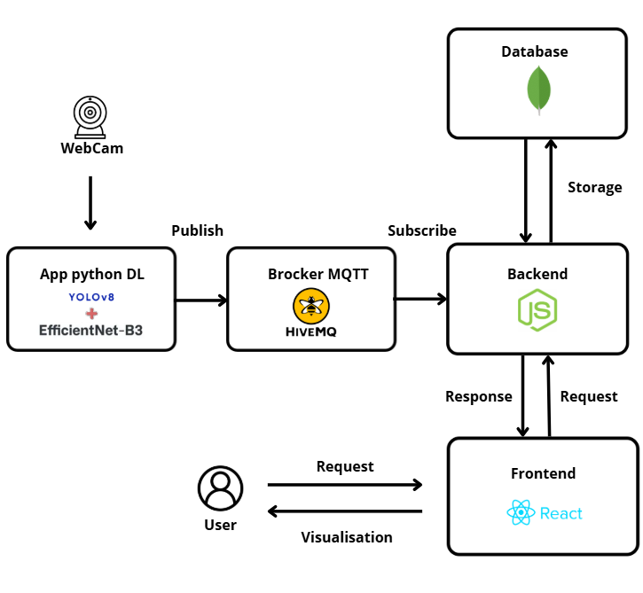

# 🌴 SmartDate IoT — Deglet Nour Date Classification System

### 🌍 University Project 

---

## 📖 Overview

**SmartDate IoT** is an intelligent system designed to automatically classify **Deglet Nour dates** using a **Deep Learning model (EfficientNetB3)** integrated into a simulated **IoT pipeline**.  
The system captures images using a webcam, detects the date region with **YOLOv8**, classifies the date type, and publishes results in real time using **MQTT** toward a **web dashboard**.

This project demonstrates a complete pipeline:  
**Webcam → YOLOv8 → EfficientNetB3 → MQTT → Node.js → MongoDB → React Dashboard**

<p align="center">
  
</p>


## 🎯 Objectives

- Build an accurate deep learning model for classifying 11 types of Deglet Nour dates  
- Implement an IoT-like communication system using MQTT  
- Simulate a smart agriculture pipeline  
- Provide a real-time monitoring dashboard for visualization and analysis 

---

## 🧩 Project Structure

```plaintext
SmartDate-IoT/
│
├── Colab_Notebooks/                         → Model training, evaluation, fine-tuning
├── Date_Dataset/                            → Images for training/validation/testing
├── Docs/                                    → Documentation + architecture images
├── IOT/                                     → MQTT publisher/subscriber scripts
│   ├── .env                             
│   ├── detections_log.csv              
│   ├── inference_publish_webcam.py      
│   ├── mqtt_subscriber_save.py          
│   └── utils.py                         
│
├── Web_App/                                 → App web
│   ├── server/
│   │   ├── src/
│   │   │   ├── server.js                    → Main backend server
│   │   │   ├── db.js                    
│   │   │   ├── models/Detection.js     
│   │   │   ├── services/mqttService.js  
│   │   │   └── routes/api.js            
│   │   ├── .env
│   │   ├── package.json
│   │   └── node_modules/
│   │
│   ├── client/                              → Frontend
│   │   ├── src/
│   │   │   ├── App.jsx, main.jsx, index.css
│   │   │   ├── pages/Dashboard.jsx
│   │   │   ├── components/
│   │   │   │   ├── Header.jsx
│   │   │   │   ├── Footer.jsx
│   │   │   │   ├── KpiOverview.jsx
│   │   │   │   ├── RealtimeView.jsx
│   │   │   │   ├── HistoryList.jsx
│   │   │   │   ├── ActivityBars.jsx
│   │   │   │   ├── TypeDonut.jsx
│   │   │   │   ├── ChartPanel.jsx
│   │   │   │   └── MQTTContext.jsx
│   │   │   └── assets/
│   │   ├── public/
│   │   ├── package.json
│   │   └── node_modules/
│
├── models/
│   └── smartdate_efficientnetb3.keras       → Trained model
│
└── README.md
 ```

 ---

 ## 🔍 Key Features

### ✅ **Real-time classification using webcam**
Local capture → YOLOv8 detection → EfficientNetB3 classification → instant feedback.

### ☁️ **MQTT-based IoT communication**
Simulated edge device → cloud workflow using a secure TLS MQTT broker (HiveMQ Cloud).

### 📊 **Interactive dashboard (React + Node.js + MongoDB)**
- Real-time updates streamed from MQTT  
- Detection history  
- Daily activity timeline  
- Type distribution donut chart  
- Confidence score monitoring  
- Intelligent recommendations  

### 💡 **Smart Recommendations**
The system generates user-friendly suggestions based on:
- the detected date type  
- the confidence level  


---

## ⚙️ Workflow Phases

### **1️⃣ Deep Learning Model Training**
- Dataset cleaning & augmentation  
- EfficientNetB3 fine-tuning on Google Colab  
- Evaluation + best model export (Keras format)  

### **2️⃣ IoT Simulation with MQTT**
- Webcam capture  
- YOLOv8 date localization  
- EfficientNet date type classification  
- MQTT publishing (TLS secured)  
- Subscriber saving detection logs into MongoDB + CSV  

### **3️⃣ Web Application**
- Node.js backend (REST API + MQTT listener)  
- MongoDB database  
- React front-end dashboard for:
  - real-time updates  
  - charts  
  - history  
  - recommendations  

---


## 📚 Installation & Usage

### ▶️ **1. Run the IoT scripts**

#### **Publisher** (Webcam → YOLOv8 → EfficientNet → MQTT)

```bash
python IOT/inference_publish_webcam.py
```
#### **Subscriber** (MQTT → MongoDB + CSV)

```bash
python IOT/mqtt_subscriber_save.py
```

### ▶️ **2. Start the backend server**

```bash
cd Web_App/server
npm install
npm start
```
### ▶️ **3. Start the frontend dashboard**

```bash
cd Web_App/client
npm install
npm run dev
```


## ⚖️ Licence

This project is distributed under the **MIT license** — you are free to reuse it for **educational or personal purposes**, provided you cite the original author.

---
⭐ SmartDate IoT demonstrates how Deep Learning + IoT + Web technologies can work together to build a smart, connected, and real-time agricultural system.

🌾 Smart agriculture starts with smart data.


